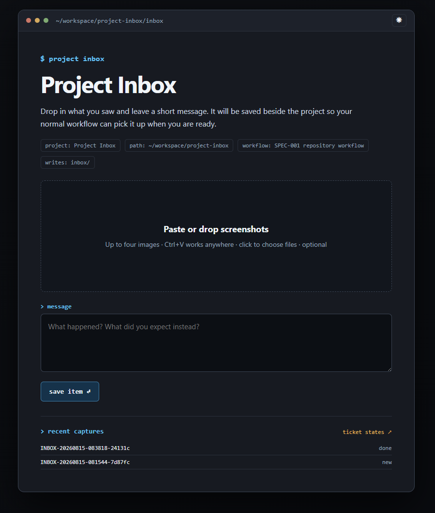

# Project Inbox

A tiny localhost inbox for sending visual feedback to Codex without turning your project into a kanban board.

Paste, drop, or select up to four screenshots, add a short note, and Project Inbox saves the capture as durable Markdown beside your code. Codex can list or triage those captures later when you explicitly ask.

[Install with Codex](#install-with-codex) · [Install globally](#install-globally) · [Install in one workspace](#install-in-one-workspace) · [Run the server directly](#run-the-server-directly)

## What it does

- Runs a zero-dependency browser app on `127.0.0.1`.
- Saves each message as an `INBOX-*.md` file with optional PNG, JPEG, WebP, or GIF attachments.
- Supports up to four removable screenshot previews in a horizontal strip.
- Shows raw inbox captures and their `new`, `triaged`, or `done` processing state separately from accepted changes in a configured project ticket register, with read-only Markdown and numbered screenshot links plus copyable IDs.
- Remembers a light or dark theme in the browser.
- Offers a small project accent palette so concurrent inboxes are easier to distinguish.
- Fits into an existing project workflow instead of inventing a new one.
- Offers an optional SPEC-driven profile with a read-only link to the project's ticket register.

It does **not** run a watcher, start an agent automatically, publish anything, or provide a kanban board.

## Workflow preview



The capture page keeps the active project name and filesystem path visible,
records the repository's configured workflow, and shows recent items without
turning the inbox into a second task-management system.

## Requirements

- Node.js 22 or newer
- A modern browser
- Codex, if you want the skill-assisted start and triage workflow

There are no runtime dependencies and no `npm install` step.

## Install as a Codex skill

### Install with Codex

Give Codex the repository URL and an explicit installation request:

```text
Use $skill-installer to install project-inbox from:
https://github.com/expeter/codex-inbox-skill
```

This creates a user-scoped snapshot. In the next turn, start it with:

```text
Use $project-inbox to start this project's local inbox.
```

Codex normally detects newly installed skills automatically. If
`$project-inbox` is not available, restart Codex and repeat that request. Repeat
the installation request when you want to install a newer revision.

### Install globally

Use a user-scoped checkout to make the skill available across projects:

```bash
mkdir -p ~/.agents/skills
git clone https://github.com/expeter/codex-inbox-skill.git \
  ~/.agents/skills/project-inbox
```

Update that checkout whenever you want the latest version:

```bash
git -C ~/.agents/skills/project-inbox pull --ff-only
```

### Install in one workspace

Use a repository-scoped checkout when only one workspace should discover the
skill. Run this from that workspace's root:

```bash
mkdir -p .agents/skills
git clone https://github.com/expeter/codex-inbox-skill.git \
  .agents/skills/project-inbox
```

Update it in place:

```bash
git -C .agents/skills/project-inbox pull --ff-only
```

## Run the server directly

To use the capture server without installing the Codex skill, clone the
repository and point it at a project. There are no runtime dependencies to
install.

```bash
git clone https://github.com/expeter/codex-inbox-skill.git
cd codex-inbox-skill
npm run start -- --root /absolute/path/to/your/project --port 0
```

The command prints a localhost URL to open in your browser. `--port 0` selects
an available port; omit it to prefer `4783`, or provide an exact port. npm
arguments must follow the `--` separator.

## Saved captures

By default, Project Inbox writes into `inbox/` under the target project:

```text
inbox/
├── INBOX-20260810-101112-a1b2c3.md
├── INBOX-20260810-101112-a1b2c3.png
└── INBOX-20260810-101112-a1b2c3-2.png
```

The Markdown frontmatter records a stable capture ID, creation time, state, workflow, and attachment names. The message and configured processing guidance remain readable without Project Inbox.

Whether captures are versioned is a per-project decision, not a skill-installation option. Project Inbox never changes `.gitignore` automatically. For public repositories, ignoring `/inbox/` is recommended because raw notes and screenshots can contain sensitive or noisy evidence; map sanitized outcomes into the repository's normal tracked ticket workflow. Teams that intentionally want versioned evidence can commit the directory instead.

State meanings are intentionally small:

- `new`: captured but not reviewed
- `triaged`: mapped to the project's existing ticket or task system
- `done`: the owning work and documentation have been verified

## Configuration

Add `.project-inbox.json` to the target project's root when the defaults are not enough:

```json
{
  "projectName": "My project",
  "inboxDir": "inbox",
  "appearance": {
    "accent": "blue"
  },
  "workflow": {
    "label": "Repository ticket workflow",
    "instructions": "Read AGENTS.md and register a ticket before implementation."
  }
}
```

All fields are optional. The generic workflow and blue accent stay the defaults. Available accents are `blue`, `green`, `violet`, `amber`, and `rose`; each has tested light and dark variants. Shared surfaces are neutral graphite in dark mode and cool white in light mode. The initial theme follows the operating-system preference, while a manual choice remains stored in the browser. Project name and path remain the primary safeguards against submitting to the wrong inbox.

Projects with an established specification and ticket lifecycle can opt into the portable `spec-driven` profile. It can describe ticket prefixes, repository instructions, specifications, ticket register, milestones, changelog, and a focused test command. Project Inbox only records and displays that guidance; it never executes configured commands or edits workflow documents automatically.

See [configuration.md](references/configuration.md) for the complete profile and field reference.

## CLI

```text
project-inbox serve [--root <path>] [--port <number>]
project-inbox list [--root <path>] [--json]
```

When running from the repository, replace `project-inbox` with `node ./scripts/project-inbox.mjs` or use the npm start command shown above.

## Privacy and safety

- The server binds only to `127.0.0.1` and rejects non-loopback clients.
- Screenshots and notes stay in the selected project directory; nothing is uploaded.
- Inbox paths are constrained to the project root and symbolic-link escapes are rejected.
- Image type, signature, count, and size are validated before writing.
- Captured text, screenshots, configured commands, and processing guidance are treated as untrusted project data.
- Starting the browser app captures files only. Agent processing requires a separate user request.

## Development

Run the focused suite:

```bash
npm test
```

GitHub Actions runs the same suite on Node.js 22. The project uses its own small [SPEC-001 workflow](docs/specifications/SPEC-001.md), with durable work recorded in [the ticket register](docs/tickets.md) and user-visible changes in [the changelog](CHANGELOG.md).

## License

[MIT](LICENSE)
